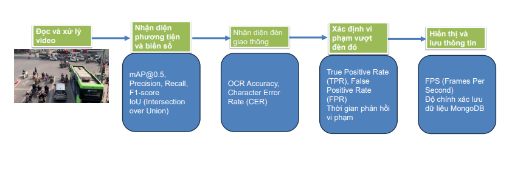
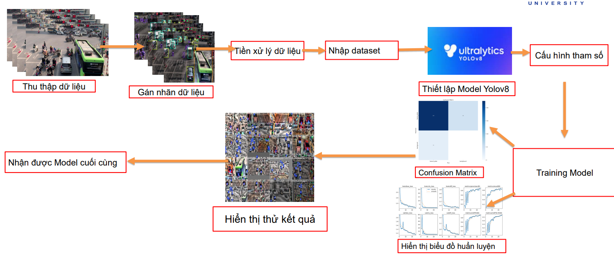
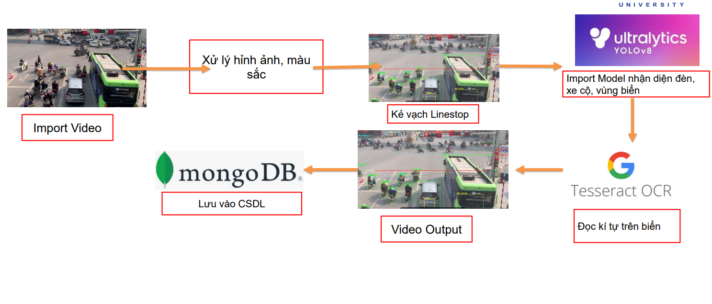

# 🎓 Hệ thống Phát hiện xe vi phạm vượt đèn đỏ cùng nhận diện biển số

<div align="center">

<p align="center">
  
  
</p>

[](https://fit.dainam.edu.vn)
[](https://fit.dainam.edu.vn)
[](https://dainam.edu.vn)

</div>

<h3 align="center">🔬 Giải pháp giám sát phương tiện giao thông và phát hiện sai phạm</h3>

<p align="center">
  <strong>Hệ thống Phát hiện xe vi phạm vượt đèn đỏ tích hợp công nghệ AI và thị giác máy tính, giúp giám sát giao thông và nhận diện phương tiện một cách tự động. Dự án sử dụng YOLOv8 để phát hiện phương tiện, nhận diện biển số bằng OCR (EasyOCR, Tesseract), và phân loại đèn tín hiệu bằng xử lý ảnh HSV. Dữ liệu vi phạm được lưu trữ trong MongoDB để phục vụ phân tích và báo cáo.🚦📸</strong>
</p>


## 🏗️ Kiến trúc

<p align="center">
  
</p>

Hệ thống sử dụng kiến trúc ba tầng:

1. **🎥 Đọc và xử lý video**: Trích xuất khung hình từ video giao thông.  
2. **🚗 Nhận diện phương tiện và biển số**: Dùng YOLO phát hiện xe, OCR nhận diện biển số.  
3. **🚦 Nhận diện đèn giao thông**: Sử dụng OCR để xác định tín hiệu đèn.  
4. **⚠️ Xác định vi phạm vượt đèn đỏ**: Phân tích tương quan phương tiện và tín hiệu đèn.  
5. **💾 Hiển thị và lưu thông tin**: Ghi nhận vi phạm vào MongoDB và hiển thị kết quả.

## ✨ Tính năng chính

### 🧠 Công nghệ Trí tuệ Nhân tạo Tiên tiến
- **Phát hiện phương tiện vi phạm bằng YOLOv8**
- **Nhận diện biển số bằng EasyOCR và Tesseract**
- **Phân loại đèn tín hiệu giao thông bằng xử lý ảnh HSV**

### ⚡ Hệ thống Xử lý Hiệu suất Cao
- **Theo dõi và lưu trữ biển số phương tiện vi phạm**
- **Lưu trữ hình ảnh vi phạm và thông tin vào MongoDB**
- **Hỗ trợ giám sát đồng thời nhiều camera giao thông**

### 📊 Phân tích và Báo cáo
- **Hiển thị thông tin phương tiện vi phạm theo thời gian thực**
- **Xuất báo cáo chi tiết về số lượng vi phạm**
- **Trích xuất hình ảnh vi phạm để phục vụ xử lý**

## 🔧 Công nghệ Sử dụng

<div align="center">

### Công nghệ Cốt lõi
[](https://github.com/ultralytics/ultralytics)
[](https://opencv.org/)
[](https://github.com/JaidedAI/EasyOCR)
[](https://github.com/tesseract-ocr/tesseract)
- **YOLOv8**: Phát hiện phương tiện và biển số
- **OpenCV**: Tiền xử lý ảnh và hỗ trợ phân tích video
- **EasyOCR & Tesseract**: Nhận diện ký tự trên biển số xe
### Hệ thống Cơ sở Dữ liệu
[](https://www.mongodb.com/)
- **MongoDB**: Lưu trữ thông tin biển số và hình ảnh vi phạm

</div>

## 📥 Cài đặt

### 🛠️ Yêu cầu Tiên quyết

- 🐍 **Python** `3.8+` - Ngôn ngữ lập trình cốt lõi  
- ⚡ **CUDA** (tuỳ chọn, nếu chạy trên GPU)  
- 📚 **Thư viện Python**: `ultralytics`, `opencv-python`, `easyocr`, `pytesseract`, `pymongo`  
- 🗄️ **Cơ sở dữ liệu**: MongoDB  
### 🗃️ Thiết lập Cơ sở Dữ liệu

1. 🐘 **Thiết lập Mongodb**
   ```bash
   # Kết nối và tạo Database
    try:
      client = pymongo.MongoClient("mongodb://localhost:27017/")
      db = client["traffic_db"]
      plates_collection = db["license_plates"]  # Collection để lưu tất cả thông tin
      client.server_info()  # Kiểm tra kết nối
   except pymongo.errors.ServerSelectionTimeoutError:
      print("Không thể kết nối với MongoDB, kiểm tra lại server!")
      exit(1)
   ```
### ⚙️ Thiết lập Dự án
1. 📦 **Sao chép Kho lưu trữ**
   ```bash
    git clone https://github.com/tatthangdz123/Nhan-dien-giao-thong.git
   cd Nhan-dien-giao-thong
   ```

2. 🌟 **Cài đặt Các Phụ thuộc**
   ```bash
   pip install -r requirements.txt

   ```

3. 📚 **Cấu hình CSDL**
   ```bash
   # Khởi động MongoDB (nếu chưa có)
    mongod --dbpath /data/db &

    # Kết nối đến MongoDB
    mongo --host localhost --port 27017

    # Tạo database
    use traffic_db

    # Tạo collection để lưu thông tin biển số xe
    db.createCollection("license_plates")
   ```

4. ⚡ **Chạy hệ thống**
   ```bash
   python nhandien.py
   ```
## 🚀 Bắt đầu

### ⚡ Thu thập và xử lý dữ liệu
<p align="center">
  
</p>

1. **Thu thập dữ liệu**: Ghi lại hình ảnh/video từ camera giao thông.  
2. **Gán nhãn dữ liệu**: Sử dụng công cụ như LabelImg để đánh dấu các đối tượng.  
3. **Tiền xử lý dữ liệu**: Chuyển đổi kích thước ảnh, chuẩn hóa dữ liệu.  
4. **Nhập dataset**: Nạp dữ liệu vào hệ thống để huấn luyện.  
5. **Cấu hình tham số**: Thiết lập các tham số cho YOLOv8.  
6. **Thiết lập Model YOLOv8**: Chọn kiến trúc phù hợp cho mô hình.  
7. **Training Model**: Huấn luyện mô hình với dữ liệu đã chuẩn bị.  
8. **Hiển thị biểu đồ huấn luyện**: Quan sát quá trình huấn luyện qua biểu đồ.  
9. **Confusion Matrix**: Đánh giá độ chính xác của mô hình.  
10. **Hiển thị thử kết quả**: Kiểm tra mô hình với dữ liệu thực tế.  
11. **Nhận được Model cuối cùng**: Xuất mô hình đã huấn luyện hoàn chỉnh.

### ⚡ Thu thập và xử lý dữ liệu
<p align="center">
  
</p>

1. **Import Video**: Nạp dữ liệu video từ camera giao thông.  
2. **Xử lý hình ảnh, màu sắc**: Tiền xử lý video, điều chỉnh màu sắc.  
3. **Kẻ vạch Linestop**: Xác định vạch dừng xe trong vùng quan sát.  
4. **Import Model YOLOv8**: Nhận diện đèn, xe cộ, vùng chứa biển số.  
5. **Tesseract OCR**: Đọc ký tự trên biển số xe.  
6. **Lưu vào CSDL (MongoDB)**: Lưu thông tin phương tiện vào cơ sở dữ liệu.  
7. **Video Output**: Xuất video kết quả với các đối tượng được đánh dấu.

</div>
